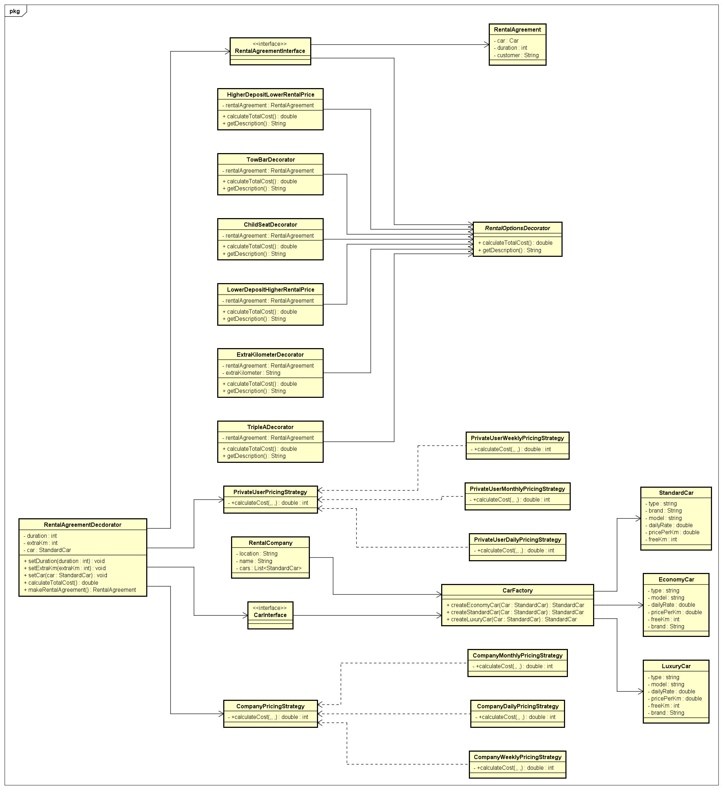

# Design Patterns Car Rental Application
This repository will be used for the assignment regarding Design Patterns
## Made by
- Roy Stobbe 3360260
- Ian Donker 4629981
## Prerequisites
The use of JDK 21 and use of minimal three design patterns.
## Design patterns which are used
In this application we were free to choose the design patterns which we wanted wanted to use. For our project we chose the following:
1. Factory pattern:
    This made us able to create and assemble cars through an interface, we chose to have three different types of car:
    - Economy car;
    - Standard car;
    - Luxury car;
    These cars are used to decorate them with options through the decorator patterns discussed next, they also have different prices for the strategy pattern.
2. Decorator pattern:
    The decorator patterns adds options to the car which leads to different prices for the rental agreement, F.E. a child seat, towbar, lower or higher deposit which equals to higher rent per day.
3. Strategy pattern:
    The strategy patterns is used finally to calculate the rent for the whole duration of the rental, it checks if the customer is a company or a private user, which then leads to a difference in taxation.
## How to run the project
- Clone the repository;
- Navigate to the Java folder, if the Java and Test folder are not marked correctly please right click them and assign them correspondingly.
- The test cases can be used to check if the application is working accordingly.
### Class diagram

